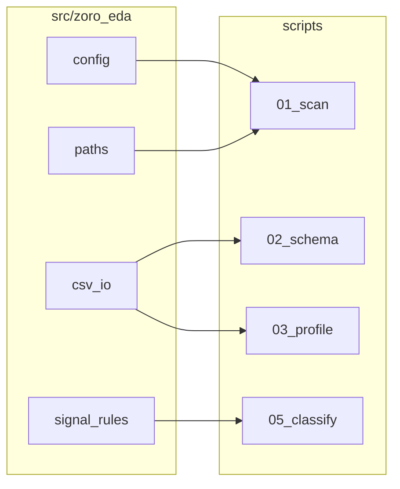

# EnFa EDA — Code Review (Readability & Maintainability)

_Generated: 2026-05-31 | Scope: `scripts/`, `notebooks/`, `config.yaml`_

This document captures a structured review of the Python EDA codebase with recommendations aligned to **industry-standard data engineering** practice — improved readability and maintainability **without** over-engineering.

---

## Executive summary

| Area | Verdict |
|------|---------|
| **`01_scan_files.py`** | Good baseline — clear functions, readable `main()`, sensible output |
| **`02_detect_schema.py`** | Good logic; naming and markdown-building could be cleaner |
| **`03_profile_timeseries.py`** | Good structure; a few magic numbers and duplicated report logic |
| **`05_classify_signals.py`** | **Largest readability problem** — compressed style, huge inline data, no types |
| **`08_generate_plots.py` / `generate_flowchart.py`** | Broken portability (hardcoded cloud paths), script-as-notebook |
| **`config.yaml`** | Exists but **scripts do not use it** — drift risk |
| **`notebooks/01_file_inventory.ipynb`** | Contains **`chr(39)`** anti-pattern; keys misaligned with script |

**Overall:** The pipeline design (head/tail only, no full 40 GB loads) is **enterprise-appropriate** for data engineering. The **code style is inconsistent**: scripts 01–03 look like maintainable tooling; 05 and 08 look like “get it done” drafts. Fixing that gap is the highest-value refactor — not adding microservices or abstract factories.

---

## What is already good (keep this)

1. **Safe large-data pattern** — 6 KB heads, head+tail profiling, no full CSV loads (02, 03).
2. **Clear module docstrings** with usage and outputs (01–03).
3. **`if __name__ == "__main__"`** entry points everywhere.
4. **Separation of pure logic** — e.g. `scan_files()`, `analyze_file_fast()`, `profile_file()` vs `main()`.
5. **`01_scan_files.py`** uses normal dict access: `r['size_mb']`, `r['relative_path']` — use this style everywhere.
6. **`config.yaml`** already documents delimiter, columns, excludes — good single source of truth **once wired up**.

---

## Critical issues (fix first)

### 1. Hardcoded machine paths (`08_generate_plots.py`, `generate_flowchart.py`)

```python
DATA_DIR = Path("/sessions/keen-upbeat-lamport/mnt/ZE/data")
PLOTS_DIR = Path("/sessions/keen-upbeat-lamport/mnt/ZE/reports/plots")
```

Same pattern in `generate_flowchart.py`. Fails on any other machine and contradicts `config.yaml` and `01`’s `--raw-dir` approach.

**Standard fix:** Resolve project root once (from `config.yaml` or `Path(__file__).resolve().parents[1]`), derive `data/` and `reports/plots/` from that. Optional `--project-root` CLI flag.

---

### 2. `config.yaml` is unused by scripts

`config.yaml` defines paths, delimiter, `head_bytes`, excludes — but scripts duplicate constants (`DELIMITER = ";"`, `HEAD_BYTES = 6144`, hardcoded Windows default paths).

**Enterprise pattern (lightweight):** One small `load_config()` (PyYAML, ~15 lines) used by all scripts. Not a framework — just stop duplicating magic strings.

---

### 3. Notebook: `chr(39)` instead of quotes

In `notebooks/01_file_inventory.ipynb`, cell 5:

```python
# BAD — do not use
print(f"{r[chr(39)]file[chr(39)]:<50} {r[chr(39)]size_mb[chr(39)]:>8.1f} MB")
```

`chr(39)` is a single quote `'`. This is unreadable and likely from bad code generation — **not** modern Python.

**Replace with:**

```python
print(f"{r['file']:<50} {r['size_mb']:>8.1f} MB")
```

Also align keys with the script: the notebook uses `file` / `size_mb`; `01_scan_files.py` uses `file_name`, `size_mb`, etc. Pick one schema.

---

### 4. `05_classify_signals.py` — maintainability bottleneck

| Issue | Example |
|--------|---------|
| Ultra-short names | `p`, `rdir`, `cdir`, `DM`, `sl` |
| One-line `main()` style | `p=argparse.ArgumentParser()` |
| Bare `except:` | `sample_range()` swallows all errors |
| 200+ line tuples in one dict | `DM` and `RULES` — correct **data**, wrong **structure** |
| Duplicated dict-building | Same `return dict(...)` twice in `match()` |
| No `TypedDict` / dataclass | Hard to see field contract for pipeline CSV |

The **domain data** (signal map) is valuable; the **presentation** is what hurts onboarding.

**Standard approach (not overkill):**

- Move rules to `config/signal_rules.yaml` or `data/signal_classification_rules.csv` **OR** keep Python but split:
  - `signal_rules.py` — only `DM` + `RULES`
  - `classify.py` — `match()`, `sample_range()`, tests
  - `05_classify_signals.py` — thin CLI
- Introduce a **`SignalClassification` dataclass** (or `TypedDict`) with one `to_row()` for CSV.
- Replace bare `except:` with `except (ValueError, IndexError, OSError):`.

---

## High priority (readability without complexity)

### 5. Duplicated “project layout” bootstrap in every script

Every `main()` repeats:

```python
raw_dir = Path(args.raw_dir)
project_root = raw_dir.parent
reports_dir = project_root / "reports"
context_dir = project_root / "context"
```

**Lightweight fix:** `src/zoro_eda/paths.py`:

```python
@dataclass(frozen=True)
class ProjectPaths:
    root: Path
    raw_data: Path
    reports: Path
    context: Path
    sample_rows: Path

def resolve_paths(raw_dir: Path | None = None, project_root: Path | None = None) -> ProjectPaths: ...
```

~40 lines total — enough “enterprise structure” for this repo.

---

### 6. Duplicated markdown report writing

Scripts 02 and 03 build markdown with `lines.append(...)` and string concatenation in loops. Works, but hard to diff and easy to break escaping.

**Pragmatic options (pick one):**

- Small helper: `write_markdown_table(path, headers, rows)`
- Or Jinja2 template for `context/*.md` (only if you add more reports)

Do **not** need a full reporting framework.

---

### 7. Broad `except Exception: pass`

In 02 (`analyze_file_fast`), 03 (`read_head_rows`), 08 (`read_signal`) — failures are silent.

**Better pattern:**

```python
except OSError as e:
    logger.warning("Failed to read %s: %s", fpath, e)
    return default_result
```

Add stdlib `logging` — one `basicConfig` in `main()`. No structlog required.

---

### 8. Magic numbers without named constants

Examples in `03_profile_timeseries.py`:

- `86400` (day in seconds)
- `0.2 * median_interval + 1` (regularity threshold)
- Interval buckets `<= 22` → `~20s`

**Fix:** Module-level constants with one-line comments:

```python
MAX_GAP_SECONDS_IN_HEAD = 86_400
INTERVAL_REGULARITY_TOLERANCE = 0.2
```

---

### 9. Inconsistent CLI defaults

All scripts default to:

`C:\Users\dellg\OneDrive\Documents\ZE\data`

**Standard:** Default to `project_root / "data"` from config or script location; allow env var `ZORO_PROJECT_ROOT`. Keeps CI and teammates working.

---

## Medium priority (polish)

### 10. `02_detect_schema.py` — internal keys leak to CSV

`"_sample_rows"` in the result dict is stripped via `extrasaction="ignore"` — good. Prefer popping before append:

```python
sample_rows = rec.pop("_sample_rows", [])
```

---

### 11. `03_profile_timeseries.py` — fragile tail parse

```python
dt = parse_ts(parts[1])  # assumes _time is always column 1
```

Script 02 finds `_time` by header. Reuse `get_time_col_idx()` on tail rows for consistency.

---

### 12. `08_generate_plots.py` — structure

- Top-level `print("Generating plots...")` runs on import — should only run in `main()`.
- 350+ lines in one file — split into functions `plot_01_interval_histogram(paths) -> None` called from `main()`.

---

### 13. Missing `src/zoro_eda/` (per CLAUDE.md)

Extract only what 3+ scripts share:

| Module | Contents |
|--------|----------|
| `paths.py` | `ProjectPaths` |
| `config.py` | load yaml |
| `csv_io.py` | `read_head`, `read_tail`, `find_column`, `parse_timestamp` |
| `signal_rules.py` | `DM` + `RULES` moved from 05 |

Do **not** implement the full package at once.

---

### 14. No tests

For enterprise confidence without heaviness:

- `tests/test_parse_ts.py` — 5 cases for `Z`, fractional seconds, empty
- `tests/test_match_signal.py` — 10 known stems from `DM`
- `tests/test_delimiter_detection.py` — synthetic 6 KB buffer

No need for full integration tests over 40 GB.

---

### 15. `requirements.txt` vs README

README mentions `jupyter`, `pdftotext`; `requirements.txt` does not. Pin dev deps in `requirements-dev.txt` or optional extras.

---

## Per-file scorecard

| File | Readability | Maintainability | Notes |
|------|-------------|-----------------|-------|
| `01_scan_files.py` | **8/10** | **8/10** | Model for others; extract path bootstrap |
| `02_detect_schema.py` | **7/10** | **7/10** | Solid; shorten `analyze_file_fast` with helpers |
| `03_profile_timeseries.py` | **7/10** | **7/10** | Good; fix tail column index |
| `05_classify_signals.py` | **3/10** | **4/10** | Refactor style + split rules data |
| `08_generate_plots.py` | **4/10** | **3/10** | Paths + `main()` guard + split plots |
| `generate_flowchart.py` | **5/10** | **5/10** | Fine as one-off; fix OUT path |
| `config.yaml` | **9/10** | **6/10** | Good doc, unused |
| `01_file_inventory.ipynb` | **4/10** | **4/10** | Fix `chr(39)`; align with script |

---

## Target structure (enterprise-light, not over-engineered)

```text
ZE/
├── config.yaml
├── scripts/
│   ├── 01_scan_files.py          # thin CLI
│   └── ...
├── src/zoro_eda/                 # shared library (small)
│   ├── __init__.py
│   ├── config.py
│   ├── paths.py
│   ├── csv_io.py
│   └── signal_rules.py           # DM + RULES moved from 05
├── tests/
│   └── test_*.py
└── data/                         # not in git
```

**Pipeline remains:** numbered scripts callable from CI or Makefile — no need for a heavy CLI package unless desired.



---

## What to avoid (over-engineering)

- Full ORM, Airflow, or Dagster for 5 scripts
- Abstract `BaseAnalyzer` class hierarchy
- Plugin registry before you have a second customer format
- Replacing CSV rules with a database
- Microservices split of `src/zoro_eda` into many packages

---

## Recommended refactor order

1. **Notebook** — replace `chr(39)`; align column names with `01_scan_files.py`.
2. **Shared `paths` + `config`** — wire 01–03 first.
3. **Fix 08 + flowchart paths**; add `main()` guard.
4. **Refactor `05`** — expand names, dataclass, split rules file, no bare `except`.
5. **Extract `csv_io.parse_ts`** — use in 03 and 08.
6. **Add ~15 unit tests** for parse/match/delimiter.
7. **Optional:** `ruff` + `black` + `pyproject.toml`.

---

## Style guide (for this repo)

```python
# Names: descriptive, no 1–2 letter variables except loop indices
records: list[dict[str, object]] = scan_files(raw_dir)

# Dict access: always normal quotes
record["file_name"]

# Errors: specific exceptions + logging, not bare except
# Config: from config.yaml, not duplicated literals
# Functions: one job, < ~40 lines where possible
# Data tables: YAML/CSV or dedicated module, not 200-line compressed tuples
# CLI: argparse with defaults from project root, not a user-specific OneDrive path
```

---

## Classes and dataclasses — when to use them

**Short answer:** Use **a few small dataclasses** (and maybe one tiny helper class). Do **not** turn the EDA pipeline into a class hierarchy — that would be overkill.

### When classes help

| Use | Example | Why it fits |
|-----|---------|-------------|
| **Dataclass / `TypedDict`** | `FileRecord`, `SignalClassification`, `TimeSeriesProfile` | Fixed fields for CSV rows; IDE autocomplete; one `to_csv_row()` |
| **`@dataclass(frozen=True)` for paths** | `ProjectPaths(root, raw_data, reports, …)` | Passed through scripts instead of 5 loose `Path` variables |
| **Small service object (optional)** | `InfluxCsvReader` with `read_head()`, `read_tail()`, `column_index()` | Same CSV logic in 02, 03, 08 — **one place** |

### When classes are overkill

- `BaseEdaStep` / `SchemaAnalyzer` / `ProfileAnalyzer` subclasses
- Abstract factories for “report writers”
- Class per script when `main()` + functions already read clearly
- Putting giant `DM` / `RULES` dicts **inside** a class — use a **module** or YAML file instead

The pipeline is **linear scripts** (01 → 02 → 03 → 05). That maps naturally to **functions + config**, not objects with lifecycle.

### Minimal class usage (recommended)

**1. Dataclasses for records (high value, low cost)**

```python
from dataclasses import dataclass, asdict

@dataclass
class SignalClassification:
    file_name: str
    signal_name: str
    category: str
    english_meaning: str
    unit_hypothesis: str
    confidence: str
    zoro_device_id_suffix: str
    zoro_metric: str
    zoro_unit: str
    exclude: bool
    # ... use_* flags

    def to_dict(self) -> dict:
        return asdict(self)
```

**2. Frozen dataclass for paths**

```python
@dataclass(frozen=True)
class ProjectPaths:
    root: Path
    raw_data: Path
    reports: Path
    context: Path
```

**3. Optional CSV reader class (medium value)**

```python
class InfluxMeasurementCsv:
    def __init__(self, path: Path, delimiter: str = ";", encoding: str = "utf-8"): ...
    def read_head(self, n: int) -> tuple[list[str], list[list[str]]]: ...
    def read_tail_timestamps(self, nbytes: int) -> list[datetime]: ...
    def time_column_index(self, header: list[str]) -> int: ...
```

No inheritance — just grouping methods that share `self.path` and `self.delimiter`.

### What to keep as functions

- `scan_files(raw_dir) -> list[FileRecord]`
- `analyze_file_fast(fpath) -> SchemaResult`
- `profile_file(fpath) -> TimeSeriesProfile`
- `match(signal_name) -> SignalClassification`

Functions + dataclasses is normal in modern Python data projects.

### Rule of thumb

| Question | If yes → | If no → |
|----------|----------|---------|
| Does it hold **stable fields** for one row/result? | Dataclass | Plain `dict` OK for prototypes |
| Does it share **setup** (path, delimiter) across many operations? | Small class | Functions + passed `Path` |
| Is it a **pipeline step** run once from CLI? | Function + `main()` | Class wrapping the whole script |

### Per-file class guidance

| File | Classes? |
|------|----------|
| `01_scan_files.py` | Optional `FileRecord` dataclass |
| `02` / `03` | `SchemaResult`, `TimeSeriesProfile` + optional `InfluxMeasurementCsv` |
| `05_classify_signals.py` | **`SignalClassification` dataclass** — biggest win; keep rules in `signal_rules.py` |
| `08_generate_plots.py` | Functions only; pass `ProjectPaths` |
| Notebooks | Plain dicts + `r['file']` — no classes needed |

---

## Bottom line

- **Architecture** (incremental EDA, read-only raw data, reports as artifacts) is sound and enterprise-appropriate.
- **Readability is uneven:** `01`–`03` are teachable; `05`, `08`, and the notebook are where new hires will struggle.
- **`chr(39)`** is a notebook-only mistake — use `r['file']`.
- **Highest ROI:** small shared `paths` + `config` + refactor `05`’s style — not a big framework.
- **Classes:** dataclasses + optional CSV reader — **not** analyzer class trees.

---

## Related documents

- [ZE_Technical_Upskilling.md](ZE_Technical_Upskilling.md) — project onboarding
- [../CLAUDE.md](../CLAUDE.md) — master project specification
- [../README.md](../README.md) — quick start and script map
